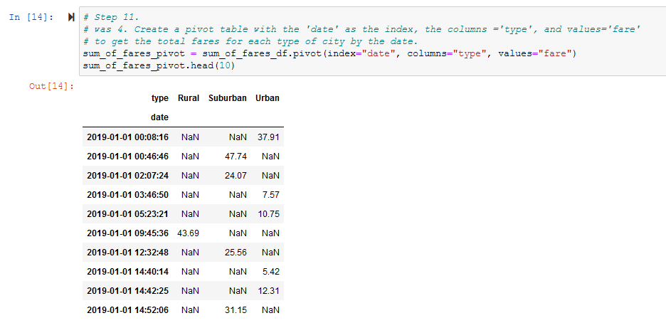
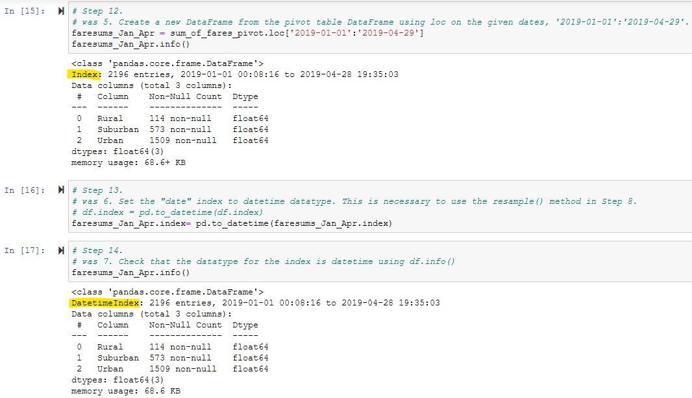
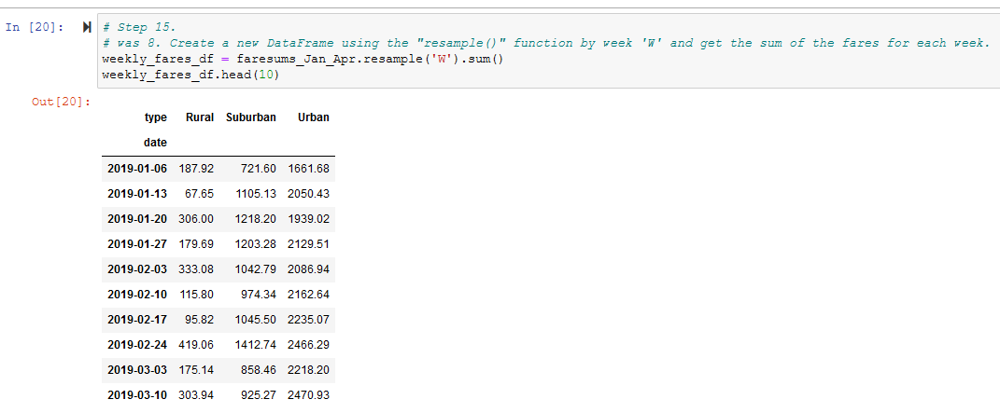
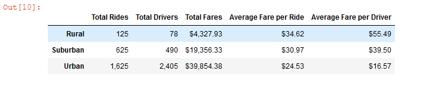
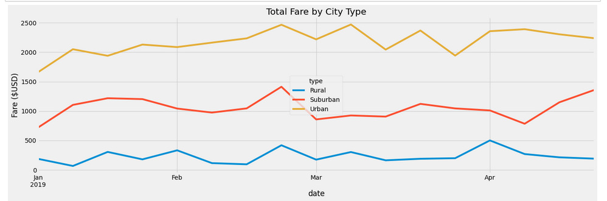
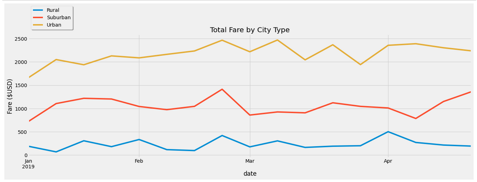

# PyBer_Analysis

## Project Overview

Using our Python skills and knowledge of Pandas, we created a summary DataFrame of the ride-sharing data by city type. Then, using Pandas and Matplotlib, we created a multiple-line graph that shows the total weekly fares for each city type. This report summarizes how the data differs by city type and how those differences can be used by decision-makers at PyBer.

## Results

In order to create a graph for weekly results, we needed to create a DataFrame, specifically a Pivot Chart which shows the rows (city), columns, and fields or interest. Figure 1 below shows our DataFrame called 'sum_of_fares_pivot' (note all the NaN's).

Figure 1. Before resample()


There are two issues with sum_of_fares_pivot. First, it has daily data but we want weekly. So we need to resample it. Before we can use resample(), we need to change the 'pandas.index' attribute to a 'DateTimeIndex' object instead of regular 'Index' object. Figure 2 shows how we used pd.to_datetime() to change the index type of the faresums_Jan_Apr DataFrame.

Figure 2. The pd.to_datetime() call


Now that our index is of the right type, we can use the resample() method on our faresums_Jan_Apr DataFrame to create a new weekly_fares_df, as shown in Figure 3 (note the absence of NaN's).

Figure 3. After resample()


Next we can collected the various data of interest into a summary DataFrame, (Figure 4), and a graph of 'Total Fare by City Type' (Figure 5). We can present these results to management review.

Figure 4. pyber_summary_df


Figure 5. PyBer_fare_summary


One minor problem with the graph is that the 'fivethirtyeight' stylesheet for Matplotlib seems to think that the "best" place for the legend is in the middle of the graph. After the following minor tweak, we achieved a better graph (Figure 6).

```
weekly_fares.legend(bbox_to_anchor=(0., 1.02, 1., .102), loc='lower left', shadow=True, fontsize='medium')
```

Figure 6. Tweaking the legend


We can draw the following conclusions from Figures 5 and 6.

1. Total Rides. There is a significant increase in the total number of rides from Rural (125), Suburban (625), to Urban (1,625). This is most likely a result of both demand, and total number of drivers (see #2 below).

2. Total Drivers. There is also a significant increase in the total number of drivers from Rural (78), Suburban (490), to Urban (2,405). This is most likely a result of both population, and profitability of the different city types (see #3 below).

3. Total Fares. The amount of money that drivers can make increases as city size increases, as shown in Figure 4.:  Rural ($4,327.93), Suburban ($19,356.33), to Urban ($39,854.38). Note that our sample data (ride.csv) only covers the time period to Jan 1, 2019 to May 8, 2019 -- just over four full months. If we divide the total fares per driver by 4 months, we estimate that drivers make approximately the following amounts for each city type per month: Rural ($1,082), Suburban ($4,839), Urban ($9,964). This fits with the actual calculation of weekly fares per driver for each city type shown in Figures 5 and Figure 6.

4. Average Fare per Ride. The average fare per ride decreases as city size increases: Rural ($34.62), Suburban ($30.97), to Urban ($24.53), most likely because of the increase in available drivers, but also because of the distance of each drive since larger urban areas are typically more dense.

5. Average Fare per Driver. The average fare per driver decreases as city size increases: Rural ($55.49), Suburban ($39.50), to Urban ($16.57), most likely because of the increase in available drivers, but also because of the distance of each drive since larger urban areas are typically more dense.


## Summary

 Recommendations:

 1. Reduce or stop rural-only operations. It is not profitable for either Pyber or their drivers. For example, the weekly gross income per driver is less than $500 per week, yet they have to pay their expenses out of that. In addition, the fares are significantly higher in rural areas. While it might make sense for customers to pay over $50 per ride, the number of customers willing to do so is probably not high enough to support rural-only service.

 2. Create a overlapping service, where drivers can participate in routes that overlap between city types. For example a driver who now only has access to rural areas, can occasionally transit between city types. This would allow drivers to increase their total income, and would increase the total number of drivers available in the suburban and rural zones.

 3. The available data only show data for January-April of 2019. It's difficult to see any seasonal cycles. It would be helpful to collect more data for follow-up analysis.
